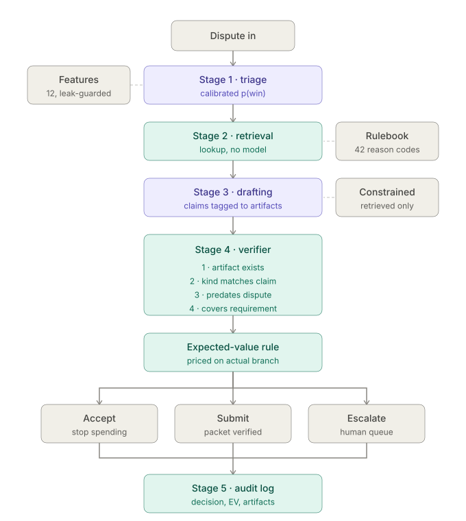

# Chargeback Triage and Evidence Agent

**Razorpay AI Buildathon, Track 02: AI Risk Manager**

Most merchants either fight every chargeback or fight none. Both are wrong. This
agent decides which disputes are worth contesting, assembles a network-compliant
evidence packet for those, and refuses to submit any claim it cannot trace back
to a source record.

Every number below is measured on a held-out set of 800 disputes the model never
saw, against two mandatory baselines. A metric without a baseline is decoration.

---

## 1. Results

### The decision (Stage 1)

| policy | net rupees | submitted / accepted / escalated | P/R (winnable) | P/R (EV) |
|---|---:|---|---|---|
| contest everything | ₹293,402 | 484 / 0 / 316 | 0.39 / 1.00 | 0.67 / 1.00 |
| contest nothing | ₹0 | 0 / 800 / 0 | 0.00 / 0.00 | 0.00 / 0.00 |
| **agent** | **₹526,279** | 392 / 370 / 38 | 0.54 / 0.74 | **0.93** / 0.75 |

The agent recovers **₹232,877 more than contesting everything**, 1.79 times the
return on the same 800 disputes, while submitting fewer packets (392 vs 484)
and sending **one eighth** as many to a human (38 vs 316).

**That gap is a sum over a heavy-tailed amount distribution, so it needs an
interval, not a point.** Resampling the 800 disputes with replacement, 2,000
times:

```
agent - contest_all    point   ₹232,877
                      95% CI   ₹200,944  to  ₹265,592
      draws where the gap <= 0        0 / 2,000
```

The obvious attack on a heavy-tailed headline is *what if the three largest
disputes had gone the other way.* They can, and the sign does not move.

```
python eval/run_eval.py --data data/holdout.jsonl --bootstrap
```

**Where completeness and hallucination are measured.** The policy scorer in
`eval/baselines.py` assembles packets deterministically rather than calling
Stages 3 and 4, so those two metrics belong to the verifier section below, where
they are measured on the real drafting path. Both are also structurally pinned
here: a packet is submitted only when it is not blocked, which means it is
already complete, and unsupported claims are stripped before submission. Neither
figure could be anything but 1.0 and 0.0 in this table.

**Two precision numbers, deliberately.** *Winnable* precision asks whether we
would have won. *EV* precision asks whether contesting was worth attempting at
₹250 a go. They disagree, and the disagreement is the product thesis.

The gap is not hypothetical, so here is a case from the holdout rather than an
invented one. `D00187`, Mastercard 4837, ₹35,535, true win probability 0.18: it
returns ₹5,431 in expected recovery against a ₹250 cost. Contesting it is
correct, and it lost, as it should roughly four times in five. It counts
against winnable precision and for EV precision, and both are right.

That case is typical, not cherry-picked. The agent contested 430 disputes and
lost 196 of them. **170 of those 196 losses, or 87%, were positive-expected-value
at the time of the decision.** The agent scores 0.54 winnable precision and 0.93
EV precision, and the distance between those two numbers is almost entirely
this. It is not trying to win every dispute. It is trying to spend well.

### The cost of being wrong

The track brief asks for this by name: rupees spent contesting losers, plus
rupees forfeited by accepting winnable cases. It is a scorecard row, not a
footnote, because the split between the two columns *is* the triage argument.

| policy | paid to lose | left behind | total |
|---|---:|---:|---:|
| contest everything | ₹326,050 | ₹0 | ₹326,050 |
| contest nothing | ₹0 | ₹697,677 | ₹697,677 |
| **agent** | **₹72,200** | **₹77,417** | **₹149,617** |

Contesting everything is wrong in exactly one direction and never leaves money
behind, which is why it looks safe and costs ₹326,050. The agent is wrong in
both directions and costs **46% of that**. It accepts some cases it would have
won. That is ₹77,417, and the column is the honest price of triage. It buys
that with a 78% reduction in wasted contests. `left_behind` is net of the
contest cost the attempt would have required.

### Where the money is, by difficulty tier

| tier | n | P/R (winnable) | P/R (EV) | net ₹ |
|---|---:|---|---|---:|
| A, documentary wins | 135 | 0.85 / 0.96 | 1.00 / 0.99 | 234,598 |
| B, winnable with the right packet | 109 | 0.63 / 0.93 | 0.99 / 0.99 | 161,428 |
| C, the ambiguous middle | 287 | 0.39 / 0.48 | 0.97 / 0.54 | 94,424 |
| D, very difficult | 151 | 0.13 / 0.45 | 0.63 / 0.70 | 38,979 |
| E, structurally unwinnable | 118 | 0.00 / 0.00 | 1.00 / 0.27 | −3,150 |

Tier E is the point of the project. The agent wins **nothing** there. Winnable
precision and recall are both zero, and it has learned to mostly stop trying:
EV recall of 0.27 means it declines nearly three quarters of the cases a naive
expected-value reading would contest. Industry data puts the representment win
rate for true fraud chargebacks at 9.27%; for a class of disputes that wins
roughly one time in eleven, at a cost per attempt, the correct action is to
accept immediately and stop spending. The agent reaches that from observable
features alone. It never sees the tier. The EV precision of 1.00 in that row is
not a contradiction: every Tier E case the agent did contest was
positive-expected-value at the time of the decision. Correct by the rule, and
still a loss.

The residual −₹3,150 is honest and worth stating: with a heavy-tailed amount
distribution, a 5% chance on a ₹80,000 dispute clears a ₹250 threshold on
expected value and still loses four times in five. Expected value is a long-run
rule; losing individual bets is how it works. That loss is 0.6% of the total.

### The verifier (Stage 4)

Hallucination is treated as a compliance failure, not a known limitation. A
fabricated delivery timestamp in a representment packet is false evidence
submitted to a card network, by a merchant the aggregator is responsible for.

The verifier is a hard gate with five deterministic checks: the cited artifact
exists, its kind matches what the claim asserts, it predates the dispute, the
field value the claim copies matches the artifact's actual value, and the
surviving claims still cover the reason code's documented requirement. The first
four strip claims; the fifth blocks the packet.

**The fifth check exists because the first four were not enough, and the way
that was found is worth reporting.** Checks 1-3 are all structural: they ask
whether the citation points at a real, correctly typed, sufficiently old
document. They say nothing about whether the claim's *content* matches that
document's content. So the exact example quoted above, "delivered on 3 March",
citing a real, correctly typed, correctly dated `delivery_confirmation` that
actually records 11 March, passed every check. The failure mode the whole
architecture is justified by was the one the gate did not enforce.

The injector had the same blind spot. It generated bad artifact IDs and kind
mismatches, so *detection tracking injection* only demonstrated that the
verifier catches faults built to be catchable. That is E1's lesson a second
time: a measurement that cannot fail is not a measurement.

Both were fixed together. Claims are now `{artifact_id, asserts_kind,
asserts_field, asserts_value}` triples checked against the record, and a fifth
fault class corrupts a field value inside an otherwise perfect artifact.
Re-running the curve with the harder injector, against both verifiers:

| injected | four checks (old) | five checks (now) | blocked (now) | completeness |
|---:|---:|---:|---:|---:|
| 0.00 | 0.000 | 0.000 | 0.395 | 0.828 |
| 0.05 | 0.036 | 0.051 | 0.535 | 0.784 |
| 0.10 | 0.067 | 0.099 | 0.650 | 0.744 |
| 0.20 | 0.131 | 0.194 | 0.807 | 0.663 |
| 0.40 | 0.260 | 0.385 | 0.946 | 0.501 |

*n = 800, mock provider, all disputes (`agent/verify.py`), so the blocked column
is the contest-everything population. The agent-triaged equivalent is
`eval/llm_packet_eval.py`, and its blocked column is lower throughout for the
reason given below. The earlier version of this table was measured on the first
50 disputes, `verify.py`'s default, and did not say so; it reproduces exactly at
`python agent/verify.py data/holdout.jsonl 50`.*

The old verifier now visibly undershoots. It detects about two thirds of what
is injected, and the missing third is precisely the field-level class. The
five-check verifier tracks injection across the same eightfold range. **No
fabrication reached a submitted packet at any fault rate under either
configuration**, because a stripped claim cannot satisfy the coverage check;
what changed is how many faults are seen at all. `CB_FIELD_CHECK=off` restores
the four-check behaviour so the two columns can be reproduced.

A claim that names no checkable field is stripped as unverifiable rather than
trusted, on the same logic: a gate cannot pass what it cannot check. That is
counted separately from fabrication, because an unverifiable claim is a
drafting-format failure and not a lie.

**The zero-fault intercept did not move**, 0.395 before and after, which
matters, because the intercept is the finding below and a new check that
inflated it would have been buying the result.

**On the real model.** `gemini-3.1-flash-lite`, over the first 50 disputes, run
on both populations so the numbers are comparable to the mock rows above:

```
                       claims   halluc   value   unver   block   complete
contest-everything        223    0.000   0.000   0.000   0.340      0.844
agent-triaged (31)        149    0.000   0.000   0.000   0.129      0.948
```

Every column is **identical to the mock's zero-fault row on the same
population**, including the exact claim count. A real model and a deterministic
stub, sharing no code past the rulebook lookup, produce the same structure and
the same zero. That is what makes the block rates below a property of the
evidence rather than an artifact of how the mock builds claims.

**`unver` is 0.000 across all 223 claims**, which is the load-bearing number.
The drafting schema now demands that each claim name an artifact field and copy
its value, and the model did so on every claim without exception. **`value` is
also 0.000**: every copied value matched the record. So the zero-fabrication
result is no longer only about references. The model invented neither an
artifact nor a *value inside* one, which is the failure mode §4 exists to catch.

Two honest limits on that. The artifact payloads are short scalars, a tracking
ID or a day number, so copying them is an easy instruction to follow. The claim
is that the model does not fabricate values it has been asked to copy, not that
it never fabricates. And 50 disputes at one temperature is a small sample. The
injected-fault curve, not this run, is what demonstrates the gate works when a
model does fabricate.

A zero fabrication rate does not make the gate redundant; it means this model
did not test it. Both claims are needed and neither substitutes for the other.

**The intercept is the more interesting number, and it depends on which
disputes you ask about.** At *zero* model error, **39.5% of all 800 disputes
block**, on evidence timestamped after the dispute and on required documents
that never existed at all. Under the agent's triage the same floor is **8.8%**
(38 of the 430 it contests). Both are correct and they are not the same
measurement, so the harness reporting each says which:

```
python agent/verify.py data/holdout.jsonl 800              # 0.395, all disputes
python eval/llm_packet_eval.py                             # 0.088, agent-triaged
python eval/llm_packet_eval.py --policy contest_all        # 0.395, matches above
```

Those two floors, 38 and 316 packets, are exactly the escalation counts in the
scorecard. That is a useful cross-check rather than a coincidence: the
deterministic packet builder and the mock LLM path, which share no code past the
rulebook lookup, agree to the packet at zero injected fault.

The gap between them is a second-order result worth stating outright. **Triage
cuts the structural block floor by 78% without touching the verifier**, because
the disputes whose evidence never existed are disproportionately the ones not
worth contesting anyway. The evidence gap and the EV signal are correlated in
the data, and declining on expected value quietly declines most of the
unwinnable-on-paperwork cases too.

One holdout case (D00003, Visa 13.1) blocks on a single missing item,
`service_completion_records`, with no claim stripped and no model error anywhere
in the chain. That share of the human queue is structural. No improvement in
drafting removes it. **The bottleneck is evidence assembly, not generation.**

A note on reading the `struct` column at non-zero fault rates: it falls from
0.088 to 0.037 as injection rises, which is attribution, not improvement. A
packet blocked on both an unreachable kind *and* a kind the drafter lost is
attributed to the model, so structural blocks get reclassified rather than
disappearing. The floor is only readable at fault rate zero.

### The model barely beats a hand-written rule

This is the least flattering number in the project, so it goes above the
robustness section rather than in a footnote. Swap the calibrated classifier for
the hand-written heuristic it replaced, one documented command:

```
CB_P_WIN=heuristic python eval/run_eval.py --data data/holdout.jsonl
```

|  | net rupees | AUC | Brier | ECE | sub/acc/esc |
|---|---:|---:|---:|---:|---|
| heuristic | **531,493** | 0.770 | 0.1939 | 0.0848 | 423/348/29 |
| calibrated model | 526,279 | 0.803 | 0.1744 | 0.0337 | 392/370/38 |

**The heuristic nets ₹5,214 more.** The two policies score the same 800
disputes, so the difference is taken per dispute and then resampled, 2,000
times. That gives a 95% CI of **[−₹13,233, +₹21,871]**, with 547 of 2,000 draws
at or below zero. The two are not distinguishable on net rupees, and anyone
claiming the model wins on this metric is reading noise.

```
python eval/run_eval.py --data data/holdout.jsonl --ablation
```

The interval is a Monte Carlo estimate, so the bounds move by a few hundred
rupees across seeds (7, 41 and 99 give [−13,233, +21,871], [−13,569, +21,570]
and [−13,666, +22,103], with 547, 557 and 549 draws at or below zero). The
conclusion does not move. Default seed is 7; `--n-boot` changes the resample
count.

What the model does win is calibration: **ECE 0.034 against 0.085, Brier 0.174
against 0.194**. That matters here specifically, because the EV rule multiplies
p(win) by rupees. A policy that is right on average while being wrong about
*which* cases is fragile to the constant changes swept below. And the
heuristic's confidence floor was hand-tuned against this dataset, which the
model's was not.

The honest conclusion is that **the classifier is not where the value is.** The
value is in the EV framing, the verifier gate, and the triage reframe; the
classifier is a replaceable component that happens to be better calibrated than
the rule it replaced. A submission claiming a model beat a heuristic by ₹5,214
on n=800 would be claiming something this project's own bootstrap contradicts.

### The merchant loop, and where verification ends

The structural intercept says 40% of packets block on evidence that was
timestamped after the dispute or never existed, and that no drafting
improvement removes it. The merchant is the only party who can. So the
dashboard asks. Optionally, once, without nagging.

**What the system is doing there is pricing information.** For every missing
document, `serve/evidence.py::opportunities()` injects a probe record, re-scores
the dispute through the same classifier and the same EV rule, and prices that
document by the expected value it would unlock. Each is priced alone rather than
cumulatively, because two documents that block the same packet are worth their
joint effect once, not twice. The results are ranked by that value, and the ones
with a positive price carry it in the interface.

**It prices and labels; it does not filter, and that is deliberate.** Across the
queue 688 items are surfaced. 333 price above zero, **290 price at exactly
zero**, and **65 price marginally negative**, between −₹1.43 and −₹154.74.

The 290 are zero *because they were priced alone*, and every one of them sits on
a dispute missing two or more documents: no single record unblocks the packet,
so each is individually worth nothing while the set is worth a great deal. The
65 are a quirk of the classifier rather than of the evidence. Adding a record
moves `n_present`, `n_missing` and `completeness` together, and the learned model
is not monotone in that move, so a handful of probes come back very slightly
lower. It is a small, measured illustration of the point made above: the
classifier is a replaceable component with quirks, not the source of the value.

Filtering on positive EV would therefore hide precisely the documents a merchant
has to supply together. The ranking is the judgement; the list is the honest
input to it.

That is still a decision rather than a form, and the concrete case is the
clearest way to see it. On `D00015` one record is priced at ₹811 against a case
sitting at −₹728, and supplying it flips the recommendation from accept to
contest. The acquisition itself runs through the merchant, because a document
that was never written cannot be retrieved by any amount of searching. This is
the same expected-value machinery that drives Stage 1, pointed at a different
question: not *should we contest this*, but *what is it worth knowing before we
decide*.

Measured across the 800:

- **316 disputes (40%) show a prompt**, and all 316 unblock if answered.
- **240 flip** from "do not contest" to "contest".
- **172 need exactly one document**, and the verdict turns on that single
  document in 122 of them.
- **₹476,247 of expected value moves** if every prompt were answered. That
  figure needs two corrections, and both are large.

**It is a sum of expected values, not of rupees.** Each missing document is
priced by the EV it would unlock, and those prices are summed. Re-running the
same scenario and measuring the *realized* net rupee impact with the actual
outcomes gives **₹59,110**, not ₹476,247. An eight-fold gap.

The cause is a defect this README documents elsewhere: the model is
over-confident by 21 points on blocked packets specifically (predicted 0.449
against an observed 0.237, n=38, `python eval/subpop_calibration.py`). Evidence prices are computed from those
probabilities, so they inherit the error, and summing 316 of them compounds it.
**₹59,110 is the number that survives measurement; ₹476,247 is what the model
believes.** The gap between the two is worth more than either figure, because it
prices a calibration failure in rupees.

**And it assumes every merchant answers, with a typed reference.** Neither
holds. Sweeping the two unmeasured parameters, averaged over five seeds:

| merchants who answer | typed references | via document upload |
|---:|---:|---:|
| 20% | +₹5,709 | +₹5,091 |
| 40% | +₹23,369 | +₹17,262 |
| 60% | +₹33,311 | +₹29,136 |
| 80% | +₹47,250 | +₹36,608 |
| 100% | +₹59,110 | +₹47,245 |

The right-hand column applies an ingestion recovery of 83%, because a merchant
"responding" means attaching a document and a document is only evidence if
extraction recovers a reference from it. **Effective response rate is
willingness times recovery**, so extraction accuracy is a multiplier on this
feature rather than a separate concern.

**Why 83% and not the other two numbers available.** The deterministic router
recovers 42.7%, but that was measured against a mock provider that cannot read
prose at all, so every prose-routed document counted as a miss; it understates
the layer rather than measuring it. `qwen3:8b` recovered 20 of 20 with zero
wrong values, but on 20 documents the 95% interval runs from roughly 0.83
upward, so quoting 100% would be quoting the top of what the evidence supports.
83% is the lower bound of the observation and the figure this table uses.

That sweep also says something the single-parameter view hides: **extraction
quality is a larger lever here than merchant willingness.** Moving recovery from
42.7% to 83% is worth more at every willingness level than moving willingness
one step is at fixed recovery.

```
python eval/timeline_eval.py --recovery 0.83
```

Neither the response rate nor the 15-day window is asserted as a point estimate.
Razorpay publishes a 15-to-30-day verdict window but not the merchant's evidence
window, and no reliable figure for Indian merchant response behaviour is
public, so both are swept and the result is reported as a curve for the same
reason the four cost constants are.

**What that ₹476,247 is not.** It is not money recovered without a human. Every
one of those unblocks depends on a record the merchant asserted, and the system
itself marks those as unverifiable. The accurate claim is narrower and better:
the loop converts **unverifiable absence into audited assertion**, moving that
EV from "a person must find this document" to "the system recommends, with the
dependency permanently flagged."

**Where verification ends.** The five checks compare a *claim* against a
*record*. For a merchant-supplied record the merchant is the source of both
sides, so a faithful claim about an invented value passes every check honestly.
Filing `INVENTED-99999` against D00003's missing document produces 5 claims
drafted, 0 stripped, packet submittable, p(win) 0.137 → 0.639. **This is
architectural, not a bug, and no check closes it.** There is no ground truth to
compare a merchant-only artifact against.

An earlier version of this README and of the code's own integrity notes claimed
check 4 caught this. That claim was false and is recorded as error 9 below. The
gate closes *model* fabrication. It cannot close *merchant* fabrication.

What the system does instead is refuse to hide it. Provenance is marked
permanently on the artifact; `serve/packet.py` computes
`depends_on_merchant_evidence` by testing whether the system-retrieved kinds
alone still cover the rulebook; and that flag appears in the API response, the
audit line, and as a warning on the packet panel. Requiring a typed value
rather than a tick is friction and an evidence trail, not a security control.

Stating the boundary is the risk-management position. A system that cannot say
where its own verification stops is not one an acquirer should sit behind.

### Merchant memory does not pay, and the reason is the calibration defect

`agent/sequential.py` keeps per-merchant state -- how often a merchant has
answered an evidence request, and how quickly -- and uses it to decide whether
asking is worth the delay. `generator/enrich_v3.py` supplies the merchant IDs
and traits it learns from, drawn from a separate random stream so no existing
figure moves. The merchant's true response rate is latent and guarded by
`assert_no_leaks()`, like every other structural field.

It was built to test one question: does knowing who you are dealing with change
the decision? Measured across three prompt costs:

| prompt cost | never ask | always ask | value-of-information + memory |
|---:|---:|---:|---:|
| ₹15 | 526,279 | **549,078** | 545,412 |
| ₹150 | **526,279** | 506,418 | 500,388 |
| ₹400 | **526,279** | 427,418 | 454,587 |

**Selectivity never wins.** When prompting is nearly free, asking everyone beats
asking selectively, because the memory declines a handful of prompts that would
have paid. When prompting is expensive, not asking at all beats both.

The failure is specific and it is not the memory's, which was established by
ablation rather than argued. Replace the learned memory with an **oracle that
reads each merchant's true response rate**, a deliberate leak that could never
ship and exists only to remove estimation error entirely:

| prompt cost | never | always | VOI learned | VOI oracle | perfect knowledge worth |
|---:|---:|---:|---:|---:|---:|
| ₹15 | 526,279 | 549,078 | 545,412 | 550,468 | +₹5,056 |
| ₹150 | **526,279** | 506,418 | 500,388 | 494,014 | −₹6,374 |
| ₹400 | **526,279** | 427,418 | 454,587 | 458,103 | +₹3,516 |

**Perfect merchant knowledge is worth approximately nothing** — inconsistent in
sign, and small next to a ₹232,877 headline. Oracle VOI still loses to never
asking at ₹150 and above.

And the memory is not starved either, which was the competing explanation. The
median merchant appears in 4 disputes, so a Beta posterior updated four times
might have sat on its prior. It does not: mean error against the true response
rate falls **0.314 to 0.201 to 0.147 to 0.085** as asks accumulate. The memory
learns.

So both candidate causes are ruled out and the remaining one is the classifier.
A rational value-of-information rule at ₹400 a prompt should decline almost
everything, since the alternative is a policy already worth ₹526,279. It sends
207 prompts and ends ₹71,692 behind, about ₹346 lost per prompt. It over-values
information because it prices information with the model's own p(win), **and the
model is over-confident by 21 points on exactly the blocked disputes it wants to
ask about** (§1). The information looks worth having because the packet looks
more winnable than it is.

```
python eval/oracle_ablation.py
```

That is the fifth independent route to the same defect. The capacity sweep
found it in the escalation decisions, the escalation analysis in the calibration
by subpopulation, the merchant loop in the gap between ₹476,247 of expected
value and ₹59,110 realized, and this in a policy that asks too often. All four
are the same 21 points, priced in four different currencies.

**So the memory ships turned off**, and the honest conclusion is not that
per-merchant state is useless. It is that no decision layer built on top of this
classifier can be trusted on blocked packets until the calibration is fixed, and
the only measured fix costs the generalisation test. Adding intelligence above a
miscalibrated probability makes the miscalibration more expensive, not less.

```
python eval/sequential_eval.py --sweep-prompt-cost
```

### Robustness: the constants were chosen, not measured

Four numbers underpin every rupee figure: contest cost, human review cost, net
recovery fraction, and the rate at which a human can rescue a blocked packet. No
public figure exists for any of them in an Indian context. Each was swept one at
a time (`data/cost_sweep_results.txt`):

| constant | range | agent | contest-all |
|---|---|---|---|
| contest cost | ₹100 → ₹900 (9×) | 605,729 → 335,964 | 413,402 → **−226,598** |
| human review cost | ₹300 → ₹2,500 (8×) | 549,581 → 511,300 (−7.0%) | 451,402 → **−243,798** |
| net recovery | 0.5 → 1.0 | 265,658 → 650,516 | **−13,858** → 425,085 |
| human resolve rate | 0.2 → 0.8 | 508,338 → 526,279 (+3.5%) | 203,586 → 293,402 (+44%) |

The agent wins at every value tested. More usefully, it is far *less sensitive*:
across an 8× change in review cost it moves 7.0%, while contest-all turns
negative. Contest-all goes negative in three of the four sweeps; the agent never
does, and its worst value anywhere is ₹265,658.

The mechanism is simple. The agent escalates 38 packets; contest-all escalates
316. Where the true cost of human review is unknown, and it is, that
difference in exposure is the argument.

**Two objections to answer before they are raised.**

*The first is that the defaults look cherry-picked.* The shipped human resolve
rate, 0.80, sits at the top of its swept range, which reads like quoting the
headline from the favourable end. Check the direction: the agent's lead over
contest-all is ₹304,752 at a resolve rate of 0.2 and ₹232,877 at 0.8. The
**margin is narrowest at the default**, because a generous resolve rate helps
the policy escalating 316 packets far more than the one escalating 38. Every
untested value below the default widens the gap. Contest cost runs the other
way. The margin grows from ₹192,327 at ₹100 to ₹562,562 at ₹900, so ₹250 sits
in the lower third, and only an implausibly cheap ₹100 contest produces a
narrower margin than the shipped figure.

*The second is the one actually worth worrying about, so here it is stated
plainly.* The result is most exposed to **human review being cheap**. At ₹300 a
review the margin falls to **₹98,179**, the narrowest figure anywhere in the
sweep, 58% below the headline. The mechanism is direct: the agent's advantage is
substantially an escalation-exposure advantage, 38 packets against 316, and if a
human costs almost nothing then contest-all's queue costs almost nothing either.
The agent still wins, and it still wins at every value tested. But a reviewer who
believes chargeback review is cheap labour should be shown ₹98,179 rather than
₹232,877, and the honest version of the claim is that the *sign* is robust
across every constant while the *size* is not.

A fifth constant, the ₹1,500 median order value, is **not** swept: varying it
requires regenerating the datasets and retraining rather than rescoring. It is
disclosed as a stated assumption in §3.

### A negative result: confidence thresholds do not help

An obvious alternative to expected value is a confidence floor: never contest
below some p(win), whatever the amount. Swept from 0.00 to 0.30 on the holdout,
it peaks at zero and loses **₹28,154 at the very first step above it**.

```
floor   net rupees
0.00     526,279   <- peak
0.05     498,125
0.10     493,547
0.15     478,932
0.20     479,143
0.25     483,193
0.30     479,385
```

Tier D collapses from ₹38,979 to ₹10,825 at a floor of 0.05 and turns negative
by 0.15. The floor kills the high-amount low-probability cases that
expected value says are worth attempting. A ₹2,00,000 dispute at 20% odds is
worth an analyst's hour, and a floor at 0.25 throws it away. It cannot
distinguish "low probability because unwinnable" from "low probability but a
large amount", and the second is where triage earns its keep.

**This result took three runs to get right, and that is worth reporting too.**
On an earlier, invented amount distribution the floor cost ₹65,616. On resampled
real amounts, with the escalation branch still mispriced, it appeared to *gain*
₹10,250 at a floor of 0.20, a gain that did not replicate on a second dataset,
and that vanished entirely once the escalation cost was corrected (§3). The
floor was compensating for an accounting error, not adding anything.

**The floor peaks at 0.00, which is the bottom of its own swept range, and a
maximum sitting on a boundary is not a demonstrated maximum.** So the
accept/contest boundary itself is swept in both directions, contesting if
`ev > T`, with T from −₹300 to +₹300. Negative T contests marginally EV-negative
cases; positive T demands a margin.

```
   T      net rupees   sub/acc/esc
-300         525,050   484/264/52
-200         526,619   479/274/47
-100         534,286   445/314/41   <- highest
   0         526,279   392/370/38   <- shipped
+100         528,063   334/434/32
+200         519,051   297/473/30
+300         505,840   266/508/26
```

The optimum is interior rather than on a boundary, which is what the sweep was
for. But **it is not a real gain and it is not being claimed as one.** The
₹8,007 improvement at T = −₹100 has a bootstrap 95% CI of [−₹1,493, ₹19,010],
with 107 of 2,000 resamples at or below zero. The curve is flat to within ±1.7%
across a ₹400 band. The defensible statement is the weaker one: *the boundary at
zero cannot be improved on at 95% confidence, and the policy is not
systematically mistuned in either direction.* T stays at zero.

```
python eval/run_eval.py --data data/holdout.jsonl --ev-sweep
```

---

## 2. The pipeline

Input is a dispute. Output is a decision, a verified packet, and a log line.



**Stage 1, triage.** A calibrated gradient-boosted classifier scores p(win)
from reason code, amount, evidence completeness, address match, prior disputes,
device signals and artifact timestamps. An expected-value rule converts that
into a decision.

The EV rule prices against the branch the case will *actually* take. The packet
is built *before* the decision, because a case whose packet will be blocked does
not cost ₹250. The packet was already assembled, so it costs ₹250 plus ₹800 of
analyst time, and it pays out only on the fraction a human can resolve. Pricing
every contest identically overspends on the cases least able to repay
it. Building the packet first was worth ₹72,850; pricing the blocked branch
correctly cut the human queue by a further 24%.

**Stage 2, retrieval. No model.** Look up the reason code in the rulebook, pull
exactly those artifacts. A dictionary lookup and a filter. Routing this through
an LLM would add latency, cost, and a failure mode, in exchange for nothing.

**Stage 3, drafting.** A language model produces a structured claims list, not
prose: each claim carries the ID of the artifact supporting it and the evidence
kind it asserts. The model sees *only* what Stage 2 retrieved, so it cannot cite
something that was never pulled. That removes one whole class of fabrication by
construction rather than by instruction.

**Stage 4, the verifier.** Four deterministic checks per claim: the artifact
exists, its kind matches what the claim asserts, it predates the dispute, and
after stripping, the survivors still satisfy the reason code's requirement.
Nothing here uses a model to check a model; that just moves the trust problem.
Failing the first three strips a claim. Failing the fourth blocks the packet and
routes it to a human.

**Stage 5, audit and stopping rules.** Every dispute produces a durable record:
decision, p(win), the EV calculation, artifacts used, verifier result. No
submission of a packet that failed verification. A drafting failure returns zero
claims, which the verifier treats as incomplete. A failed API call can never
become a submission.

A merchant-facing dashboard over the same pipeline lives in `webapp/` (Vite +
React + TypeScript) with a FastAPI backend in `serve/`. Every scored field it
displays comes from the modules above; the API routes and serialises, it does
not decide anything.

### Why this is a pipeline and not an agent

Stages 2 and 4 use no model, the five stages run in the same order every time,
and nothing replans or selects tools. By most 2026 definitions this is not an
agent, and it is worth saying so before a reviewer does.

Two agentic additions were considered, and the difference between them is the
whole answer.

**A retrieval loop cannot fire.** Letting the verifier send the drafter back to
look for alternative artifacts that satisfy a missing requirement sounds right
and is empty here: **across all 316 blocked packets, zero contain an unretrieved
artifact that could close the gap.** `retrieve()` already returns everything in
the record. On D00003 that is 4 artifacts of 4, and the fifth required document
does not exist. Such a loop would search, find nothing, and escalate exactly
where the pipeline escalates now.

**A redraft loop can fire, and it is built.** `agent/redraft.py` feeds the
verifier's rejections back as corrections and allows one retry before
escalation. Against the mock at a 0.10 injected fault rate it cuts blocked
packets from 520 to 394. But it retries only when a strip is a drafting error a
rewrite could fix, so at zero model error it makes zero extra calls, and on
`gemini-3.1-flash-lite` across 10 disputes with 5 blocked packets it made zero
retries, and `qwen3:8b` running locally gave the identical count. Every block was
structural or temporal. Full numbers in §3.

So the loop exists, it works, and on the model this project ships it correctly
does nothing. Its value is a function of how bad the drafter is. It is opt-in
and wired to nothing, because every published figure here was measured without
it.

The bottleneck is not search strategy, and it is not drafting quality either. It
is that the document was never written. That is the structural intercept
arriving from a third direction, and it is the argument against adding agency
here rather than an admission of missing it.

The defensible position: deterministic where trust is required, a model where
judgment is required, actions with priced consequences, and a full audit trail.

### Model quality

Trained on 3,000 disputes. Reported twice: on an internal 25% split of the
training file, which is the number used for model selection, and on the 800-row
holdout, which is the number that licenses the EV rule.

```
                          internal split      holdout (800)
base win rate                    0.4347             0.3937
reference Brier  b(1-b)          0.2458             0.2387
AUC                               0.800              0.803
Brier                            0.1760             0.1744
Brier skill                       0.284              0.269
ECE                              0.0285             0.0337
mean predicted p(win)                --             0.4227  (observed 0.3937)
```

**Read the reference-Brier row carefully.** `0.2458` is not a base rate; it is
`b(1−b)` at a base rate of `0.4347`, which is the Brier score of the constant
predictor. The skill score divides by that, not by `b`. This is spelled out
because dividing by the base rate itself instead is an easy misreading and
produces `0.051`, a number this project does not claim.

The holdout is generated with a different seed and shifted tier weights, so its
prior is 4.1 points lower than training. The model carries the training prior
across: mean predicted p(win) is `0.4227` against an observed `0.3937`, so it is
mildly **over**-confident on the holdout, and every reliability bin above 0.1
predicts at or above the observed rate. Direction matters, because over-confidence
under an EV rule means contesting slightly too much, not too little.
`data/reliability.png` (internal), `data/reliability_holdout.png` (holdout).

```
python agent/classifier.py --holdout data/holdout.jsonl
```

Calibration matters more than ranking here, because the EV rule multiplies
p(win) by rupees. A model that says 0.9 when it is right 0.6 of the time
overspends systematically, and AUC will not catch it.

Two honest notes. On the internal split the model is mildly overconfident in the
0.6-0.7 band (predicted 0.638, observed 0.548) on 31 samples, and mildly
underconfident from 0.7 to 0.9. Neither is worth correcting; both are within
what 3,000 rows supports. Ranking transfers to the holdout intact (AUC 0.803);
the small calibration cost there is the prior shift, not overfitting.

**A finding worth stating plainly: better data made a better model, not better
tuning.** AUC rose from 0.783 to 0.800 and ECE fell from 0.067 to 0.0285 purely
from replacing the amount distribution with resampled real transactions. Same
features, same algorithm, no hyperparameter changes.

---

## 3. Data and its limits

The most important section in this README. Everything that is real, everything
that is generated, and what would change with production data.

### What is real

**The rulebook.** `rulebook/reason_codes.yaml` holds 42 reason codes across UPI,
Visa, Mastercard, RuPay, American Express and Razorpay's own RZP codes, each
mapped to its evidence requirements and to the field of Razorpay's contest API
that evidence would be submitted under. Verified against Razorpay's published
documentation on 27 August 2026.

**The submission schema.** Packets are keyed to the real API fields
(`shipping_proof`, `billing_proof`, `proof_of_service`, `access_activity_log`,
and so on) rather than an invented taxonomy. A packet this agent assembles maps
onto an actual `PATCH /v1/disputes/:id/contest` payload.

**The transaction substrate.** Amounts are drawn from the empirical distribution
of IEEE-CIS Fraud Detection (Kaggle/Vesta), 590,540 real e-commerce
transactions, and rescaled. Hour-of-day and day-of-week cycles are taken from
the same source. `data/amount_overlay.png`.

This is a resampling, not a parametric fit. An earlier version fitted a
log-normal to the real sigma of 0.954, and the overlay chart showed why that was
not good enough: real p99/median is 15.28 and the fitted distribution gave 8.71.
IEEE-CIS has a skew of 14.37 and a maximum 464 times its median. No log-normal
reproduces that, and real amounts additionally cluster at price points. Drawing
real values directly and rescaling gives p90/median 3.75 against the real 3.91,
and p99/median 13.52 against 15.28. The residual gap is the sampling pool being
20,000 of the 590,540 transactions.

**The scale is set, not fitted.** IEEE-CIS is in USD, and converting US order
sizes at an exchange rate would give a ~₹5,700 median, which is not what Indian
e-commerce looks like. The median is set to ₹1,500, between two published
figures: Indian e-commerce AOV of US$59 (ECDB, 2024, ~₹5,000) and quick-commerce
AOV of ₹500 (Economic Times). Both are means; the empirical mean/median ratio in
IEEE-CIS is 1.94, implying medians of ~₹2,580 and ~₹258. ₹1,500 sits between
them and reflects Razorpay's base being dominated by small e-commerce merchants
rather than the big-ticket categories that pull the national AOV upward. It is
not swept, because varying it requires regenerating the datasets rather than
rescoring.

**The honest description of the dataset is: real transaction substrate,
generated dispute layer.**

### What is generated

Dispute outcome data does not exist publicly, least of all for Indian merchants.
Razorpay legally cannot share it, being an RBI-regulated aggregator under
PCI-DSS. Every
applicant hits the same wall, and Track 4 of this buildathon specifies synthetic
data outright.

Generated: which transactions get disputed and under which code; the evidence
artifacts; and the win/lose outcome per dispute. A 24-pattern case taxonomy
across five difficulty tiers, with true win-probability bands per pattern.

Five rules keep it honest:

1. **The generator was written and frozen before any model code.** The evidence
   for this is structural rather than chronological: the generator has no
   knowledge of the model, and the model reads its features through a guard
   (rule 2) that fails the run on contact with any latent field. The repository
   was initialised late in the build, so the commit history does not
   independently attest the ordering.
2. **The model is not handed the structure it must find.** Tier, pattern ID and
   true win probability are written into each record with a leading underscore
   and are excluded by a guard in `agent/features.py` that fails the run if one
   is ever read as a feature.
3. **The holdout is generated differently.** Different seed, shifted tier
   weights, and one dispute pattern (C5, evidence timestamped after the dispute)
   that appears *only* in the holdout.
4. **Unwinnable cases exist by design.** Tier E has no tell to find. The ceiling
   is not 100% and the project is not a one-line conditional.
5. **Calibrated against a real substrate.** See above.

### What is still not real

**The four cost constants were chosen, not measured.** Contest cost ₹250, human
review ₹800, net recovery 0.85, human resolve rate 0.80. No public figure exists
for any of them in an Indian context. This is why they are swept (§1).

**Net recovery is modelled proportionally; real chargeback fees are flat.** The
0.85 treats the fee as a share of the amount, so it implies a ₹90 fee on a ₹600
dispute and a ₹3,300 fee on a ₹22,000 one. A flat ₹400 fee would leave the small
dispute with nothing worth recovering. The distortion is concentrated below about
₹5,000, which is the densest part of the distribution, and it biases toward
contesting small disputes. Stated rather than corrected, because changing it
means another full regeneration.

**The human-queue model is deliberately conservative.** An escalated case is
assumed to reach a person who can repair the packet but cannot change the facts
so the human gets no skill bonus, only the ability to unblock.

**Packet quality does not affect the win rate.** The outcome label is drawn from
the case pattern and does not depend on the packet the agent assembles, because
the counterfactual is unknowable. So Stages 3 and 4 contribute to the money only
through the block decision, never through better outcomes. A reader would
reasonably assume otherwise.

**The benchmarks quoted are US or global, not Indian.** The 41% overall
representment win rate, 9.27% for true fraud, and 12-18% net recovery are
vendor-published and survey-based, predominantly US. No reliable India-specific
chargeback benchmark is publicly available. Applying them to Indian merchants is
an assumption, and it is labelled as one wherever it appears. Note also that the
12-18% figure is *portfolio* net recovery, which already contains the win rate.
it is not comparable to the 0.85 constant above, which is the share recovered
given a win.

**Four rulebook entries are provisional.** Razorpay's evidence page groups codes
under four category tabs; only the Customer Dispute tab was retrievable. Visa
10.4, 12.5 and 12.6, and Mastercard 4837, are compiled from card-network
documentation via third-party references and are tagged
`provenance: network_docs` in the rulebook. The generator prints a warning
naming them on every run.

**"Suggested", not "required".** Razorpay labels these Suggested Documents. This
project treats the full suggested list as the completeness bar, because a
partial packet is the failure mode worth measuring. That is a modelling choice,
not a claim about what the networks mandate.

**The real-model hallucination measurement is one model on one dataset.**
`gemini-3.1-flash-lite` produced zero fabrications across 223 claims on 50
disputes (§1). By the rule of three that bounds the rate below roughly 1.3%, but
it is a single model on a single generated dataset at one temperature.

Two halves of that zero deserve different amounts of credit. The
**reference-level** zero, meaning no invented artifact IDs and no upgraded kinds, is
substantially explained by the constrained retrieval: the model cannot cite an
artifact it was never shown, so the architecture is doing work the model is not.
The **value-level** zero is not explained that way. Nothing in retrieval stops a
model from misstating a figure inside an artifact it *was* shown, which is
why check 4 exists. That half is a result about the model rather than
about the harness, and it is the half worth quoting.

A zero here still means the verifier was *untested* by this model, not that it
is unnecessary; that is exactly what the fault-injection curve is for.

**Training and holdout amounts come from the same sampling pool.** Other
parameters differ between the two sets by design; amounts do not, because both
are samples from the same real distribution.

### Nine errors found and corrected during the build

All are in the git history rather than quietly fixed, because how a system fails
is part of what it is. Most produced a *plausible number* rather than a crash,
which is the expensive kind. The last five were found by auditing the finished
system rather than while building it, and three of those are errors in the
*reporting* rather than the code: a wrong worked example, an overstated fix, and
a false security claim. That is a category worth naming, because no test suite
covers it.

**The rulebook was wrong.** v1 was transcribed from memory: RZP01 was modelled
as a duplicate-charge code when it is goods-not-provided, Visa 13.1 required an
`avs_result` that does not appear in the docs, and UPI 1064 required a
non-existent `ip_record`. Six patterns in the case taxonomy also filed the wrong
code for the scenario described, putting fraud cases under customer-dispute codes.
Everything was regenerated against the corrected rulebook. A validator now fails
the run if the taxonomy cites a code the rulebook does not define.
Pre-correction results are kept in `data/v1_pre_rulebook_fix/`.

**The cost sweep was measuring nothing.** The first version patched the constant
on `generator/distributions.py`, which drives the decision, but not on
`eval/distributions_ref.py`, which drives the scoring. It ran cleanly and printed
"the headline is robust" while having varied one constant out of four. The tell
was identical output across an 8× range. The sweep now patches both modules and
refuses to report robustness for any constant whose values produce identical
results.

**The EV rule mispriced blocked packets, twice.** First it charged every contest
at `CONTEST_COST` and only discovered afterwards whether the packet would be
blocked; since assembly is deterministic and independent of the decision, it can
be done first. Correcting that was worth ₹72,850 and cut escalations by 72%.

Then a subtler version of the same split: `metrics.net_rupee_impact` charged
`CONTEST_COST + HUMAN_REVIEW_COST` for an escalation while the decision rule
charged `HUMAN_REVIEW_COST` alone. The agent escalated whenever gross recovery
cleared ₹1,000; the scorer only profited above ₹1,312.50. Every case in that band
was escalated by the policy and booked as a loss by the metric, the same
decision-versus-scoring drift as the cost sweep bug, one layer down. Correcting
it moved the headline from ₹529,555 to ₹526,279, cut the human queue from 50 to
38, and removed a spurious ₹10,250 result from the floor sweep.

**And the fix for that was reported as more complete than it was.** The commit
message and this README both said the escalation cost now had a single
definition in `metrics.escalation_cost()` that every path imported. Two of the
three did. `eval/baselines.py`, the decision rule itself and the path the bug had
been in, was still adding `contest_cost + HUMAN_REVIEW_COST` by hand, four
lines below a docstring in `metrics.py` explicitly forbidding exactly that. The
two expressions were numerically identical, so nothing was wrong with any
reported figure and nothing would have surfaced in a test. The tell was only
visible by grepping for the constants rather than for the function name. This is
the residue of E3 rather than a new bug, and it is the reason it is worth
writing down: **a fix that removes the symptom and leaves the mechanism in place
reads, in a commit log, exactly like a fix that removed both.** The decision path
now imports it.

**The flagship worked example was arithmetically wrong.** The paragraph
introducing the two precision definitions used "a ₹450 case we would win 80% of
the time returns ₹306 against a ₹250 cost" as an example of a *correct decline*.
It is not one: ₹306 − ₹250 = +₹56, so the rule contests it. The example also
illustrated recall while sitting in a paragraph about precision. Nothing in the
code was affected, since no metric reads that sentence, and that is why it
survived several rounds of checking the code. It now uses a real holdout case
(D00187) with the arithmetic taken from the file rather than composed by hand,
and `metrics.py` records the boundary that any future example has to clear: at
p = 0.8 a case must be under ₹368 to be a correct decline.

**The verifier and its own test shared a blind spot.** Checks 1-3 were all
structural. Real ID, right kind, old enough. None of them compared a claim's
content against the artifact's content. So a claim asserting a delivery date the
document does not contain passed every check, while citing a genuine, correctly
typed, correctly dated document. That is the exact scenario quoted at the top of
§1 to justify the architecture. The fault injector had the same gap in the same
place: it generated bad IDs and kind mismatches, so "detection tracks injection"
demonstrated only that the verifier catches faults built to be catchable. E1's
lesson, arriving a second time on a different subject: a measurement that cannot
fail is not a measurement. Both were fixed together. Claims became
`{artifact_id, asserts_kind, asserts_field, asserts_value}` triples with a fifth
check, and the injector gained a fault class that corrupts a field value inside
an otherwise perfect artifact. Against the harder injector the old verifier
detects about two thirds of what is injected; the new one tracks it. The
zero-fault intercept did not move, which is what says the new check did not
simply buy the headline result by blocking more.

**The amount distribution was too smooth.** Fitting a log-normal gave a
p99/median of 8.71 when the real data has 15.28. Real transactions have a
heavier tail and cluster at price points, so amounts are now resampled directly
rather than approximated.

**`evidence_view` disagreed with `_build_packet` on duplicate kinds.** It used
`setdefault`, so the first artifact of a kind won, while the pipeline takes the
set over all supported artifacts. One stale copy and one good copy therefore
satisfied the rulebook and displayed as "stale". The generated data never emits
a duplicate kind, so it was latent. But merchant-supplied evidence creates that
shape by design, and it would have made the whole evidence loop silently
no-op: a merchant would file the missing record and watch nothing change.

**The integrity note claimed a security property the system does not have.**
`serve/evidence.py` stated that a merchant inventing a value would be caught by
check 4, and the merchant-facing panel told the user their input was "checked
against the packet before anything is submitted." Both false, disproved by a
single request. The reasoning error is worth naming precisely: it argued by
analogy, reasoning that because the gate stops the model fabricating it must
stop the merchant fabricating, without testing whether that held. It does not, because
when the merchant supplies the record there is nothing to compare it against.
Written inside a comment block headed `_INTEGRITY`, which is the worst place in
a codebase to be confidently wrong, and shown to the one person best placed to
exploit the gap. Rewritten as a trust boundary; see §1.

### What would change with production data

The outcome labels would be real, so precision and recall would mean something
about the world rather than about a generator. Packet completeness and
hallucination rate would not change definition at all, since they are verified against
the input documents, not against a label, and do not care whether the disputes
are synthetic. That is the structural advantage of this design: only one third of
the scorecard depends on ground truth.

### What would be built next, and why it is not built now

Each of these is a documented edge of the current system rather than a wish. The
measurement that identifies it is already above.

**Monotone constraints on the classifier.** 65 of the 688 priced evidence items
come back marginally negative because the model is not monotone in a single
added record. `HistGradientBoostingClassifier` takes a `monotonic_cst`
parameter, so constraining `completeness` and `n_present` upward and `n_missing`
downward would remove that class of quirk by construction. Not done now because
it means retraining, and retraining against this holdout to fix a cosmetic
artifact is tuning against our own generator.

**Value canonicalization in check 4.** The field check is strict string
equality, which is right for generated scalars and wrong for real evidence,
where the same tracking number arrives as `AWB123456`, `awb-123456` and
`AWB 123456`. Real deployment needs per-kind normalisation before comparison.
The strictness is deliberate here: a loose comparison would reintroduce exactly
the ambiguity the check exists to remove, and on clean inputs there is nothing
to normalise.

**Per-kind evidence pricing.** The model sees counts and fractions plus a
one-hot reason code, so it knows a packet has 4 of 5 documents but not which 4.
With real outcome data it could learn that a signed delivery confirmation is
worth more than a chat transcript on Visa 13.1, and the evidence panel could
rank by that rather than by what unblocks the packet.

**A bounded redraft loop.** Built, measured, and deliberately not wired in:
`agent/redraft.py`. One verifier-fed retry before escalation, with the
rejections fed back as corrections and a trace of what changed. It is the only
genuine iteration this design accepts, and the measurements are why it stays
opt-in.

It retries only when a stripped claim is a drafting error the model could fix.
Stale artifacts and structural gaps are skipped, because no rewrite makes a
record younger or conjures a document that was never written. Against the mock
at injected fault rates of 0.10, 0.20 and 0.40 it cuts blocked packets from 520,
646 and 757 to 394, 523 and 719. At fault 0.00 it makes **zero** extra calls.

```
CB_FAULT_RATE=0.10 python agent/redraft.py data/holdout.jsonl 800
```

One note for anyone reproducing that. `MockProvider` seeds its RNG from the
`seed` argument alone and knows nothing about which dispute it is drafting, so
every harness here passes `seed=i` over the enumerated queue. Reproduce these
numbers without that convention and the injector produces no faults at any rate,
which looks like the figures being wrong rather than the caller being wrong.

On real models it also makes zero, and two of them agree exactly. Over the first
10 disputes, `gemini-3.1-flash-lite` blocked 5 with 0 retries; `qwen3:8b` at q4
on a single consumer GPU blocked the same 5, also with 0 retries. Every block was
structural or temporal. The loop's cost on a model that drafts cleanly is zero
and so is its benefit.

That agreement is the more useful result. A frontier API and an 8B local model
producing the same block count is what you would expect if blocks are properties
of the evidence rather than of the drafter, and it is measured rather than
argued. It also says the drafting job is genuinely easy once retrieval is
constrained and the schema is fixed, which is the thesis stated from the other
direction: the scarce capability is triage and verification, not generation.

That is the honest shape of agency here. The loop substitutes for drafter
quality, so it is what you would enable to serve this pipeline from a small
local model instead of a frontier API. And the mock numbers above are a null
hypothesis rather than a result: `MockProvider` ignores the feedback, so its
retry is a second random sample. Whether a model reading verifier corrections
writes a better second draft is untested, and needs a model that errs on its
own.

**Splitting `HUMAN_RESOLVE_RATE` by block reason.** A flat 0.80 over-credits the
unrepairable blocks that dominate the structural intercept. Real queue outcomes
would let each block reason carry its own resolve rate.

---

## 4. Running it

```bash
pip install scikit-learn pyyaml matplotlib pandas

# one-off: profile the real substrate (needs the Kaggle IEEE-CIS CSV)
cd generator
python profile_ieee.py /path/to/train_transaction.csv

# generate (seeded; holdout uses different parameters and one unseen pattern)
python generate.py --profile train   --n 3000 --seed 11 --out ../data/train.jsonl
python generate.py --profile holdout --n 800  --seed 97 --out ../data/holdout.jsonl

# train the calibrated classifier
cd ../agent
python classifier.py --train ../data/train.jsonl --chart ../data/reliability.png

# score all three policies
cd ../eval
python run_eval.py --data ../data/holdout.jsonl --json-out ../data/results.json

# verifier fault injection
cd ../agent
CB_FAULT_RATE=0.10 python verify.py ../data/holdout.jsonl 50

# robustness
python cost_sweep.py
```

Drafting defaults to a deterministic mock provider with a configurable fault
rate, with no API key and no network. For the real model, set `GEMINI_API_KEY` and
`CB_LLM_MODEL=gemini-3.1-flash-lite` in `.env`, then `CB_LLM=gemini`. The
reported run used 50 disputes at 4.5s intervals to stay inside the free tier's
15 requests/minute.

The dashboard needs two terminals:

```bash
cd serve  && uvicorn app:app --reload --port 8000
cd webapp && npm install && npm run dev
```

The IEEE-CIS CSV is not in this repository (683MB, and not ours to
redistribute). `rulebook/ieee_profile.json` and `data/ieee_amount_sample.json`
are, so everything downstream reproduces without it.

---

## 5. On the existing product

Razorpay's Agent Studio already ships a chargeback agent that reviews cases,
verifies proof and submits evidence. The framing is "we fight your disputes for
you," and the scarce capability in that framing is drafting.

This project does not claim novelty. It claims a reframe and a measurement. The
data says the scarce capability is not writing the rebuttal. It is knowing which
disputes deserve one, and refusing to submit a claim that cannot be traced to a
record. Merchants do not lose disputes because they cannot write. They lose
because roughly two thirds have no dedicated chargeback owner, the evidence lives
across four systems, and reason-code requirements are specialist knowledge.

That reading is the same one Track 4 of this buildathon states as the 2026
builder consensus: verification capacity, not generation speed, is the
bottleneck. The one-third intercept in §1 is that claim, measured.