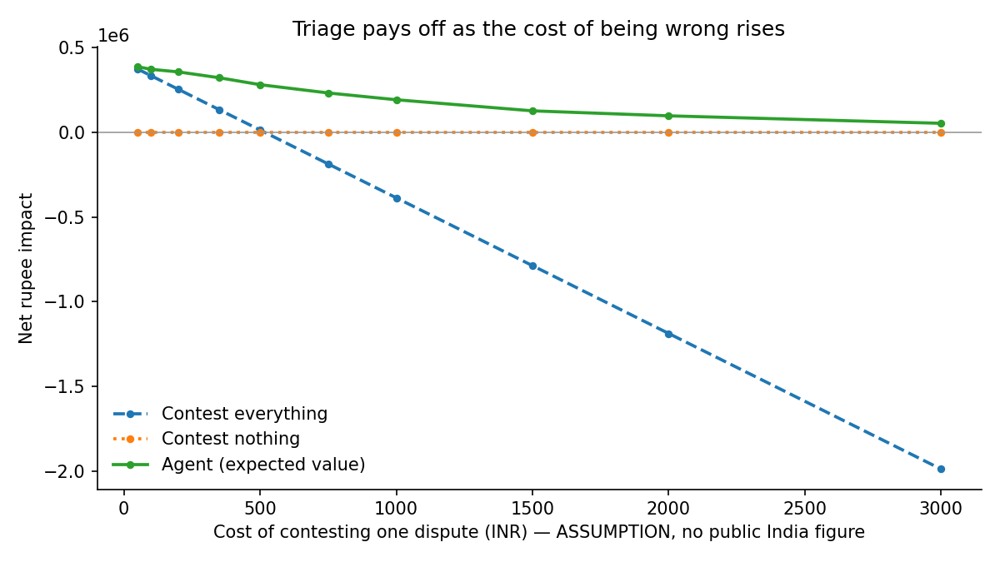

# Chargeback Triage and Evidence Agent

Decides which disputes to contest, assembles a network-compliant evidence packet
for those, and refuses to submit any claim it cannot trace to a source record.

Razorpay AI Buildathon, Track 02.

## Status

Days 1-4 of the plan are done: rulebook, frozen generator, and the full
six-metric eval harness with both baselines. **No model code yet, by design** --
the harness scores three policies (contest-all, contest-none, a deterministic
expected-value agent stub) so the classifier can drop in against a working scorer.

## Key result

Net rupee impact against both baselines, swept over the cost of contesting one
dispute (an ASSUMPTION -- no public India figure exists):



Contesting everything goes net-negative around Rs 500-750 per dispute and reaches
-Rs 2M at Rs 3,000. The expected-value agent stays positive across the whole range.
The value of triage scales with the cost of being wrong.

At Rs 250/dispute with Rs 800 human review: agent Rs 345,631 vs contest-all
Rs 212,947 vs contest-none Rs 0.

## Two definitions of "should have contested"

- `winnable`: we would have won it.
- `ev`: contesting had positive expected value at this cost.

They disagree, and the disagreement IS the thesis. A Rs 450 case we'd win 80% of
the time is a miss under `winnable` and a correct decline under `ev`. The agent
scores 0.41 precision under the first and 0.81 under the second. Both are reported.

## Three-state outcomes

`submitted` / `accepted` / `escalated`. A verifier-blocked packet is not an
accept -- it costs HUMAN_REVIEW_COST and a human resolves HUMAN_RESOLVE_RATE of
them. Scoring escalations as accepts would penalise the agent for the verifier
doing its job.

## Run it

```bash
pip install pyyaml scikit-learn lightgbm matplotlib

# generate data (generator is frozen before any model -- see FREEZE below)
cd generator
python generate.py --profile train   --n 3000 --seed 11 --out ../data/train.jsonl
python generate.py --profile holdout --n 800  --seed 97 --out ../data/holdout.jsonl

# score all three policies on the six metrics
cd ../eval
python run_eval.py --data ../data/holdout.jsonl --json-out ../data/results_holdout.json

# the contest-cost constant is an assumption, so sweep it and chart the crossover
python run_eval.py --data ../data/holdout.jsonl --sweep \
    --chart ../data/cost_curve.png --json-out ../data/sweep.json
```

## The six metrics

| metric | needs labels? | where computed |
|---|---|---|
| packet completeness | no | metrics.packet_completeness |
| hallucination rate | no | metrics.hallucination_rate |
| precision / recall | yes | metrics.precision_recall |
| cost of being wrong | yes | metrics.cost_of_being_wrong |
| net rupee impact | yes | metrics.net_rupee_impact |
| human queue load | no | metrics.human_queue_load |

Two of the three headline metrics need no labels: they are verified against the
input documents, so the synthetic-data risk is confined to one third of the
scorecard.

## Architecture (five stages)

1. **Triage** -- classifier scores p(win); an expected-value rule converts it to
   contest/accept. Currently a deterministic stub in `eval/baselines.py::agent`.
2. **Retrieval** -- deterministic rulebook lookup. No model. (`agent/retrieval.py`, TODO)
3. **Assembly** -- LLM drafts claims, each tagged to a source artifact. (`agent/assemble.py`, TODO)
4. **Verifier** -- hard gate; strips unsupported claims, blocks incomplete packets.
5. **Audit** -- one durable log line per dispute. (`agent/audit.py`, TODO)

## FREEZE discipline

The generator is committed and tagged BEFORE any model code:

```bash
git add rulebook generator && git commit -m "Freeze generator"
git tag -a generator-frozen-v1 -m "Frozen $(date -I) before any model code"
```

The public tag makes the ordering provable and pre-empts "the data was
reverse-engineered from the model".

## NEXT STEPS (in order)

1. **Day 1 real task**: download IEEE-CIS, refit `distributions.py` AMOUNT_MU/SIGMA
   and the hour/day patterns to the real amount column. Produce the overlay chart.
2. **Day 5**: train LightGBM on train.jsonl features, wrap in `CalibratedClassifierCV`
   (isotonic), replace `_estimate_p_win`. Report expected calibration error + reliability plot.
3. **Day 5-6**: build `agent/llm.py` provider interface (Ollama for dev, Gemini for
   final). Structured claims schema. Fault injection to stress the verifier.
4. **Day 6**: `agent/audit.py` durable log; demonstrate one blocked packet -> human queue.
5. **Day 7**: charts -- three-bar net-impact, calibration plot, per-tier table.

## Data and its limits

- **Real**: transaction statistical shape (IEEE-CIS), the Razorpay reason-code ->
  evidence rulebook.
- **Synthetic**: which transactions get disputed, evidence artifacts, outcomes.
- The generator encodes structure it does NOT hand the model (repeat-offender
  clustering, address mismatch, stale evidence). The model infers tier from
  observable features only.
- **Every benchmark cited (win rates, cost multiples) is US or global.** No
  reliable India-specific chargeback benchmark is public. Treated as assumptions.
- `CONTEST_COST`, `HUMAN_REVIEW_COST` and `HUMAN_RESOLVE_RATE` are assumptions
  with no public India figures. All are swept or stated explicitly rather than
  buried; see the cost curve above.
- Generator output is deterministic across Windows and Linux for a given seed.
- **UNVERIFIED, excluded from claims**: whether a won representment removes the
  dispute from the monitoring ratio; the existence of a programmatic Razorpay
  Disputes API. Assume dashboard-only until confirmed.
